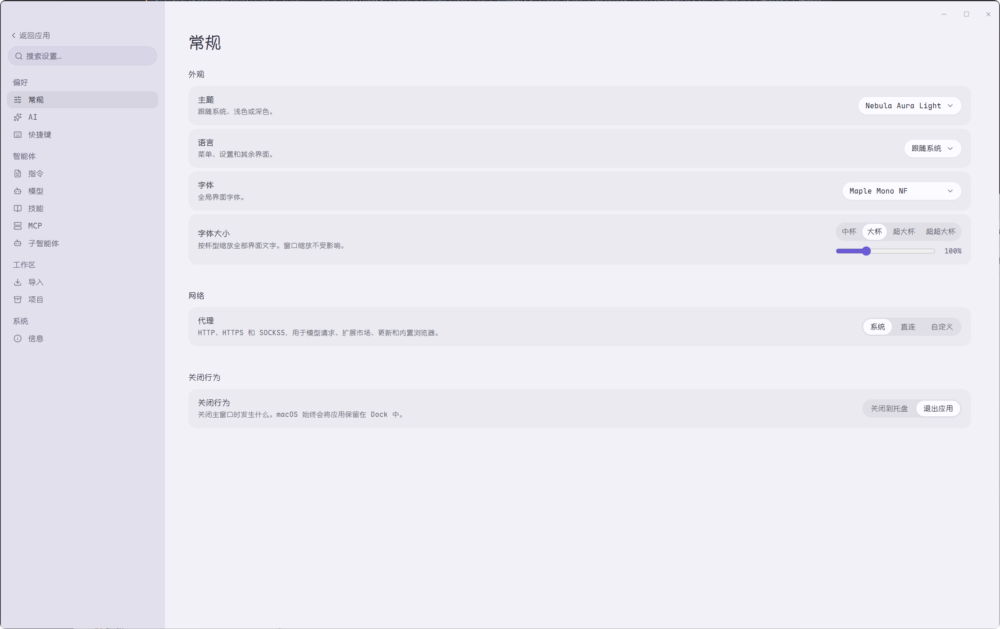
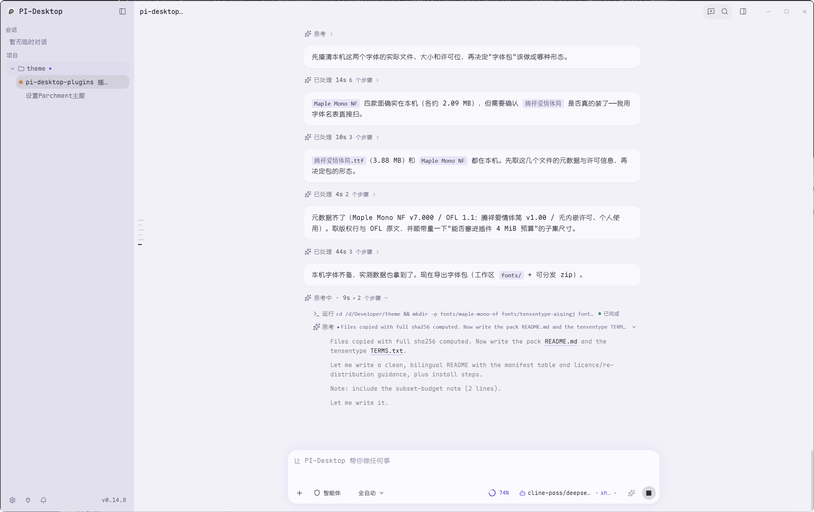
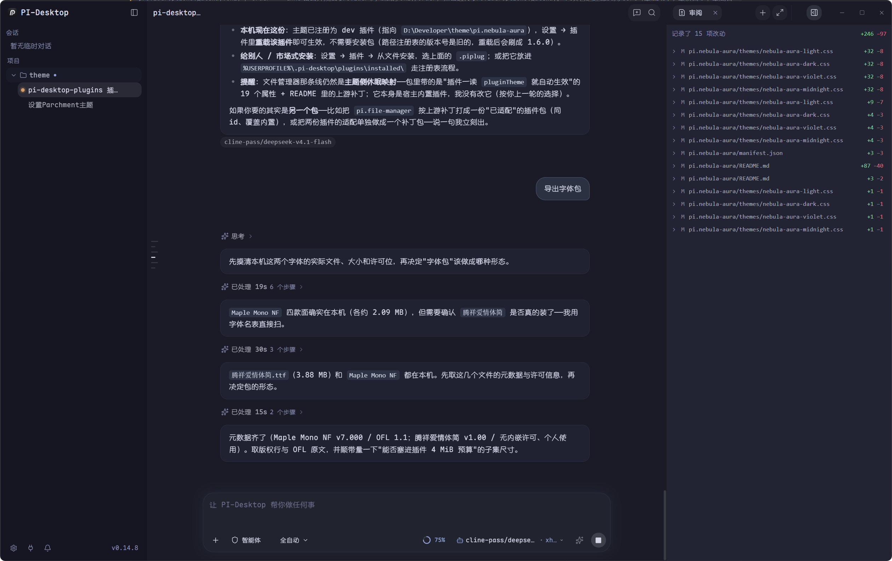
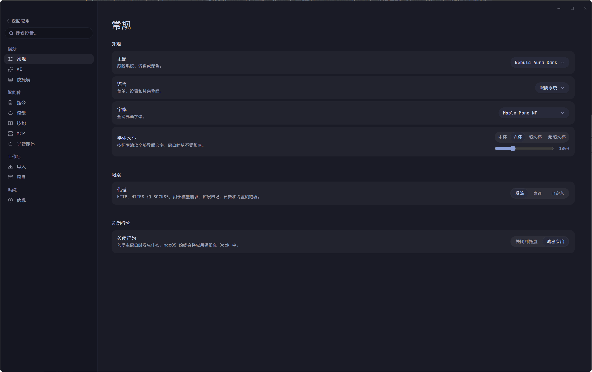
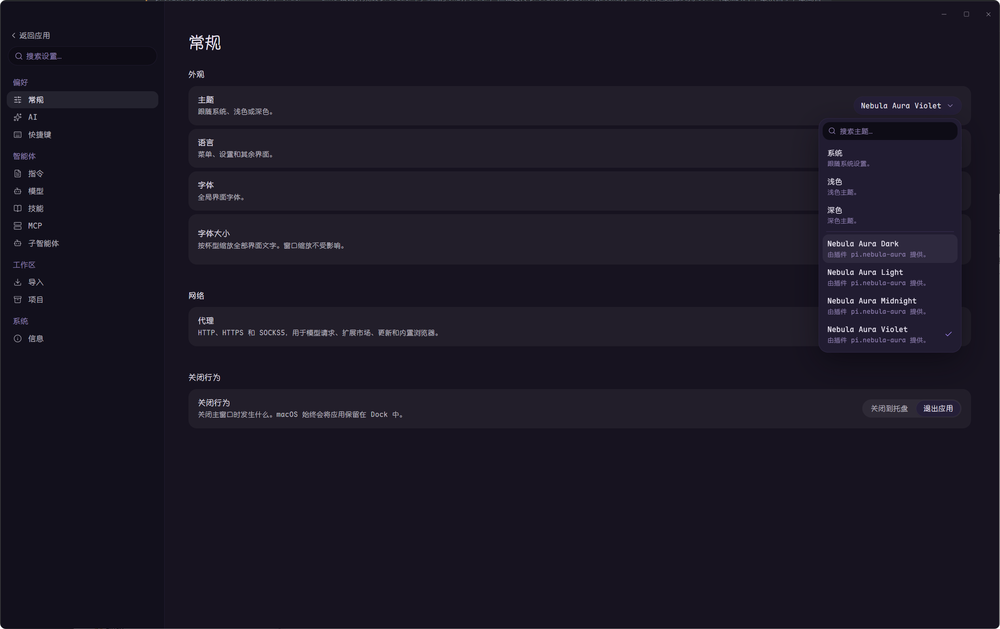

# Nebula Aura Theme for PI-Desktop / 星云光晕主题

Four **Nebula Aura** colour themes — **Light · Dark · Violet · Midnight** — for
[PI-Desktop](https://github.com/vastsa/PI-Desktop), ported from the VS Code theme pack
[nebula-aura-theme](https://github.com/luismpenholato/nebula-aura-theme) onto PI-Desktop's own
`--ds-*` design tokens. Styling only: no features, no network, no file or clipboard access.

Its plugin **shape** follows **[pi.parchment](https://github.com/vastsa/pi-desktop-plugins/tree/main/plugins/pi.parchment)**
(Parchment Theme 1.0.4, © pkmcenter, MIT) — a `ui.theme`-only global theme written as plain CSS over the
host's `--ds-*` tokens. This pack keeps that shape, swaps in a different palette and extends it to four
variants and the two adapted plugin panels.

为 [PI-Desktop](https://github.com/vastsa/PI-Desktop) 做的四套 **Nebula Aura** 配色，把 VS Code 主题包
[nebula-aura-theme](https://github.com/luismpenholato/nebula-aura-theme) 的调色板移植到 PI-Desktop 的设计令牌
（`--ds-*`）上。纯样式：无额外功能、无网络、无文件/剪贴板访问。

插件形态参考 **[pi.parchment](https://github.com/vastsa/pi-desktop-plugins/tree/main/plugins/pi.parchment)**（Parchment 主题
1.0.4，作者 pkmcenter，MIT）：只申请 `ui.theme`、纯 CSS 覆盖宿主 `--ds-*` 令牌。本主题沿用这一形态，换成 Nebula 调色板并扩展到四套配色。

| | |
|---|---|
| Plugin id / version | `pi.nebula-aura` **1.6.0** |
| Permission | `ui.theme` — contributes four global themes, CSS only |
| Requires | PI-Desktop `>= 0.4.3` |
| Package | [`pi.nebula-aura/dist/pi.nebula-aura-1.6.0.piplug`](pi.nebula-aura/dist) |
| Licence | MIT for the theme; palette © Luis Penholato (MIT); plugin shape after pi.parchment © pkmcenter (MIT); bundled font under **SIL OFL 1.1** — see [NOTICE](pi.nebula-aura/NOTICE) |

## Install / 安装

1. **Fonts (optional, but the themes are designed around them).** The stack is
   `Maple Mono NF, 腾祥爱情体简, Consolas, 'Courier New', monospace`:
   * **Maple Mono NF** (Regular / Bold / Italic / BoldItalic, v7.000) ships in
     both [`fonts/maple-mono-nf/`](fonts/maple-mono-nf) and the release asset
     `nebula-aura-fonts-1.0.0-maple-mono-nf.zip` — SIL OFL 1.1, redistributable.
   * **腾祥爱情体简** is **not** included: it is free for personal use but carries no redistribution
     grant. Get it from <https://www.tensentype.com>.
   * Fonts are referenced by family name only (no `@font-face`, nothing bundled *into* the plugin):
     the host caps a theme's declared assets at 4 MiB in total, which two full families cannot fit.
     See [fonts/README.md](fonts/README.md) and the plugin README.
   * Missing fonts are harmless — the stack falls through to `Consolas → Courier New → monospace`
     plus the system CJK face.
2. **Install the plugin** — Settings → Plugins → *Install from folder* → pick `pi.nebula-aura`, or
   install the packaged `.piplug`: `pi.nebula-aura/dist/pi.nebula-aura-1.6.0.piplug`, the same build
   as the [latest release](https://github.com/huanglininn/pi-nebula-aura/releases/latest).
3. **Choose a theme** — Settings → Theme → search `Nebula`.

## Variants / 四套配色

| Theme | Base | Backdrop | Accent |
|---|---|---|---|
| Nebula Aura Light | light | lavender aura + star field | `#6B5BD4` |
| Nebula Aura Dark | dark | blue/pink aura + star field | `#8B9FD4` |
| Nebula Aura Violet | dark | violet/magenta aura + star field | `#A78BFA` |
| Nebula Aura Midnight | dark | cyan/blue aura + star field | `#7C8CFF` |

## Screenshots / 效果预览

Captures of PI-Desktop running these themes — the author's own screenshots of the app, committed here
as previews. Midnight has no capture yet; the offline page below covers all four variants.


*Nebula Aura Light*


*Nebula Aura Light*


*Nebula Aura Dark*


*Nebula Aura Dark*


*Nebula Aura Violet*

Offline mock-up page — all four variants in one HTML file, no network, no webfont:
[`preview/index.html`](preview/index.html).

## What it covers / 覆盖范围

* Every host design token (`--ds-*`) **plus** the ~36 hardcoded neutrals the host stylesheet leaves
  behind — audited rule by rule against the shipped `app.asar` sheet and measured in Chromium.
* Four colour tokens the host reads but never defines (`--ds-danger`, `--ds-focus`, `--ds-text`,
  `--ds-text-tertiary`) — without them, mermaid error strips, focus rings and two labels silently
  lose their colour.
* Two marketplace plugin panels: **pi.gitlens** (live — it applies the active theme inside its own
  document) and **pi.file-manager** (mapping complete and gated on its own DOM signature, but dormant
  until the plugin reads the `pluginTheme` payload the host offers; the plugin README carries the
  patch).
* Nothing else: every plugin-facing rule is gated on a DOM signature that exists in exactly one
  document, so none of the 30 short custom-property names resolve in the host document.

## Repository layout / 仓库结构

```text
pi.nebula-aura/     the plugin — manifest.json, main.js, themes/*.css, README, NOTICE, dist/*.piplug
fonts/              Maple Mono NF (OFL) + install notes; 腾祥爱情体简 deliberately not included
preview/            screenshots of the themes in PI-Desktop + an offline mock-up page (index.html)
```

## Credits / 致谢

* **Palette** — [Nebula Aura Theme](https://github.com/luismpenholato/nebula-aura-theme) © Luis
  Penholato, MIT. This is an unofficial PI-Desktop port; no VS Code sources are redistributed
  (the port re-targets the palette onto PI-Desktop's tokens and writes new CSS) — see
  [NOTICE](pi.nebula-aura/NOTICE).
* **Plugin shape / prior art** — [pi.parchment](https://github.com/vastsa/pi-desktop-plugins/tree/main/plugins/pi.parchment)
  (Parchment Theme 1.0.4) © pkmcenter, MIT, from the same marketplace repository: the pattern this
  plugin follows — a `ui.theme`-only global theme written as plain CSS over the host's `--ds-*`
  tokens, scoped with `:root[data-theme=…]`, plus the panel / README / safety-notes conventions that go
  with it. No file from pi.parchment is redistributed: the CSS here is this project's own, re-targeting
  a different palette and extending the shape to four variants, the host's hardcoded neutrals and the
  two adapted plugin panels.
* **Fonts** — [Maple Mono](https://github.com/subframe7536/maple-font) © The Maple Mono Project
  Authors (subframe7536), SIL OFL 1.1.
* **Plugin interop** — the two adapted panels belong to
  [vastsa/pi-desktop-plugins](https://github.com/vastsa/pi-desktop-plugins) (MIT). Only their public
  class and custom-property names are referenced; no plugin code, CSS or asset is copied.

## Licence / 许可

MIT — see [LICENSE](LICENSE). The font under `fonts/` is licensed under **SIL OFL 1.1**, not MIT.
